# Rohit Hanuman Sai Puttagunta — GitHub Profile README Banner

## 🌙 Dark Mode Banner

<picture>
  <source media="(prefers-color-scheme: dark)" srcset="dark.svg">
  <source media="(prefers-color-scheme: light)" srcset="light.svg">
  
</picture>

---

## ☀️ Light Mode Banner



---

## 🚀 Usage in your GitHub Profile README

Add this to your **profile repository** `README.md`:

```markdown
<picture>
  <source media="(prefers-color-scheme: dark)" srcset="https://raw.githubusercontent.com/YOUR_USERNAME/YOUR_USERNAME/main/dark.svg">
  <source media="(prefers-color-scheme: light)" srcset="https://raw.githubusercontent.com/YOUR_USERNAME/YOUR_USERNAME/main/light.svg">
  
</picture>
```

Replace `YOUR_USERNAME` with your actual GitHub username.

---

## ✨ Features

- 🎨 **Cinematic glassmorphism** — Dark cosmic + light clean panels
- 🖥️ **Dual-panel layout** — ASCII portrait left, terminal info right  
- ⚡ **60+ animations** — Pure SVG, no JavaScript
- 🔤 **Animated typing** — 8 role descriptions cycle continuously
- 🌊 **Floating ASCII portrait** — Gradient-animated, scanline sweep
- 💊 **20 skill pills** — Glow borders with animated gradients
- 🏆 **4 achievement cards** — Glass morphism style
- 🔗 **5 social link pills** — GitHub, LinkedIn, Portfolio, Email, LeetCode
- 📐 **1180×610px** — Pixel-perfect responsive
- 🌗 **Auto theme switching** — Adapts to user's OS dark/light preference
